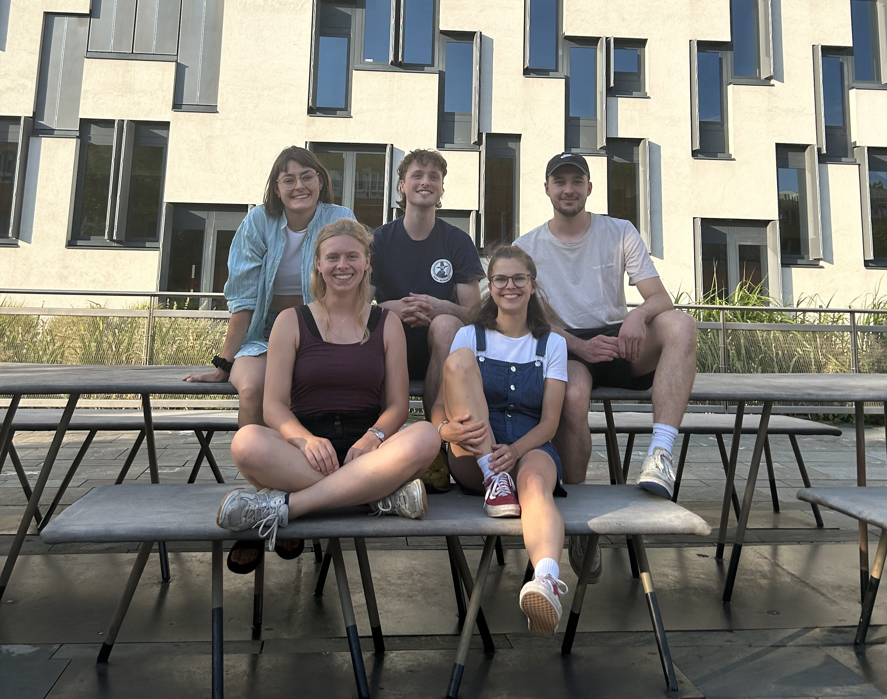
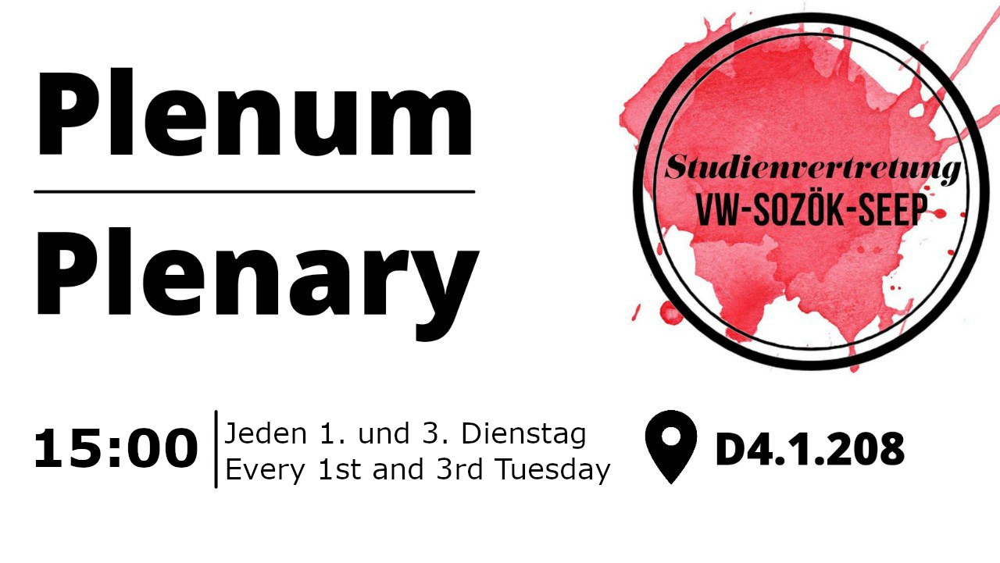

# The Team

Sarah, Lea, Nino, Susann & Max

 

Check out our
<a href="https://www.facebook.com/vwsozoekseep/" target="_blank">facebook
page</a>

follow us on
<a href="https://www.instagram.com/stv_vw.sozoek.seep/" target="_blank">Instagram</a>

contact us via
<a href="mailto:stv-vwsozoekseep@wu.ac.at" target="_blank">
stv-vwsozoekseep [at] wu.ac.at</a>

or visit us at the
<a href="https://campus.wu.ac.at/?campus=1&q=D4.1.208" target="_blank">Master
Student' Room</a>

### Plenary sessions (bi-weekly)

Our plenary sessions will be held every 1st and 3rd Tuesday each month
at 3 pm in [D4.1.208](https://campus.wu.ac.at/?campus=1&q=D4.1.208).

## Student Guides

We have created a number of Guides to help you with your studies!

### Which program is the right one for me?

These guides will try to help you decide which program (Econ, SozÖK,
SEEP) is the right one for you!
 <a href="/guides/Guide_Econ_Introduction.pdf" target="_blank">Guide:
Econ Introduction</a> 
 <a href="/guides/Guide_SEEP_Introduction.pdf" target="_blank">Guide:
SEEP Introduction</a> 
 <a href="/guides/Guide_SozOek_Overview.pdf" target="_blank">Guide:
SozÖk Einführung</a> 

### How to apply to the study programs?

These guides will lead you through the application process for Economics
and SEEP. Sozioökonomie does not have a special application process at
the moment. 
 <a href="/guides/Guide_Econ_Application.pdf" target="_blank">Guide: Econ
Application</a> 
 <a href="/guides/Guide_SEEP_Application.pdf" target="_blank">Guide:
SEEP Application</a> 

### How to write your master thesis?

These guides will introduce you to the topic of writing your master
thesis. We have compiled a few tips and tricks on how to get started in
each of the programs.  <a href="/guides/Guide_Econ_Master_Thesis.pdf" target="_blank">Guide:
Econ Master Thesis</a> 
  <a href="/guides/Guide_SEEP_Master_Thesis.pdf" target="_blank">Guide:
SEEP Master Thesis</a>

### General Guides (Academic Writing, Residence Permit, Semester Abroad)

The following guides deal with the topic of a semester abroad in each of
the Master programs as well as the general topics of scientific and
academic writing as well as how to get a residence permit if you are a
third country national.   <a href="/guides/Guide_Semester_Abroad.pdf" target="_blank">Guide: Semester Abroad</a>
  <a href="/guides/Guide_Academic_Writing.pdf" target="_blank">Guide: Academic
Writing</a>
  <a href="/guides/Guide_Residence_Permit.pdf" target="_blank">Guide: Residence
Permit</a>

## UPCOMING EVENTS

### Semester Opening Party

We are excited to meet current and the new cohorts at the semester opening Party. It will take place in the [Club U](https://www.google.com/maps/place/Club+U/@48.2001424,16.3682486,17z/data=!3m1!4b1!4m6!3m5!1s0x476d0782d36eb3eb:0xed028069cfa9015b!8m2!3d48.2001424!4d16.3708235!16s%2Fg%2F11b6__r8rp?entry=ttu) on the 6th of October 2023 at 10 pm. 

### R Tutorials for women*

## PASSED EVENTS 

click here
 

### R Tutorials for Women*

We have once again organized an R-Tutorial for women\*! This tutorial is open for everybody defining themselves as FLINT\* (female, lesbian, non-binary, trans).
University is often very male-dominated. With this tutorial we want to explicitly support women\*/FLINT\* in these important fields.
Please register via Mail: stv-vwsozoekseep [at] wu.ac.at and check the [FB-Event](https://www.facebook.com/events/838838533536224/) for Updates.

Time: always 17:00 - 19:00 (5pm - 7pm)

* Thursday, November 11
* Thursday, November 26
* Thursday, December 3
* Thursday, December 10

### Welcome Event Master Economics.Socio-Economics.SEEP

We are excited to meet the new cohort at the welcome event of the Master's programmes. You can find our presentation [here](./presi.pdf).

### R Tutorials (free of charge - free to join)

Time: always 18:00 - 20:00 (6pm - 8pm)

* Monday, October 19
* Monday, November 2
* Monday, November 9
* Monday, November 16

[Gitlab](https://gitlab.com/r-students-WU/tutorial-winter-2020)  [MS Teams](https://teams.microsoft.com/l/channel/19%3a327200012dc14dbd841564f7381a0037%40thread.tacv2/General?groupId=7c500954-683b-4f5f-9ed0-78a687c4f8d6&tenantId=0504f721-d451-402b-b884-381428559e39)

### COVID 19 Distance Learning Survey

How is distance learning going so far? What needs to be improved? We, as your elected student representatives want to ensure that this semester, even with the limitations, can still be without negative effects for you. We therefore ask you for your feedback on the distance learning, which we will forward to the program coordinators. 

Take part in our [Survey!](https://forms.gle/KdA7jY7Qjnd55Di49)

### VW Heuriger

The next VW Heuriger will be on <del>Friday, 20 March 2020 at 6 p.m. at the 10er Marie. See [FB-Event](https://www.facebook.com/events/809146516163428/) </del> Unfortunately this event was cancelled due to the [COVID-19](https://coronavirus.wien.gv.at/site/faq-english/) Outbreak.

### Momentum Junior Fellowship Program

The Momentum Institute's Junior Fellowship Program offers the opportunity to write master's and doctoral theses in areas such as work, fiscal policy, environment - with professional and financial support: [Apply now!](https://www.momentum-institut.at/junior-fellowship-themen)

### Punsch & Plenum | Punch & Plenary

It's that time again - we're celebrating the end of the year! We're therefore very happy to invite you to punch and cookies, in our Econ.SocEcon.SEEP Room in D4. There will be punch as long as it lasts - at 19:30 we will go to the Punschstände in front of LC. 
We will also use the time to discuss projects and ideas for the next year. We're very much looking forward to seeing you there! [Event](https://www.facebook.com/events/1005659323120801/)

## Standpunkte

**"Let's talk about Economics - Perceptions in Media and Society"**
Issue 18 \| March 2020 \| [PDF](./standpunkte/Standpunkte_18.pdf)

**"Die Ökonomie als Wissenschaft"** Ausgabe Nummer 17 \| Juni 2019 \|
[PDF](./standpunkte/Standpunkte_17_3_.pdf)

**"Arbeitsverhältnisse"** Ausgabe Nummer 16 \| Mai 2018 \|
[PDF](./standpunkte/Standpunkte16_Final1.pdf)

**"Nachhaltigkeit."** Ausgabe Nummer 15 Oktober 2017 \|
[PDF](./standpunkte/Standpunkte15.pdf)

**"Die verlorene Ausgabe - Die Standpunkte sind zurück"** Ausgabe Nummer
14 \| März 2017 \| [PDF](./standpunkte/Standpunkte_14-Aktuell.pdf)
**"Volldampf Voraus! - Wege aus der Krise"** Ausgabe Nummer 13 \| April
2015 \| [PDF](./standpunkte/Standpunkte13_-_Volldampf_Voraus.pdf)

**"Mit vielen Brillen - Ökonomie als plurale Wissenschaft"** Ausgabe
Nummer 12 \| Mai 2014 \| [PDF](./standpunkte/standpunkte12_05-2014.pdf)

**"Was kostet die Welt? - Wie bewertet man das Unbezahlbare?"** Ausgabe
Nummer 11 \| November 2012 \|
[PDF](./standpunkte/standpunkte11_11-2012.pdf)

**"Spaziergang um den Tellerrand - Ökonomische Kritik und
Alternativen"** Ausgabe Nummer 10 \| Februar 2012 \|
[PDF](./standpunkte/standpunkte10_02-2012.pdf)

**"Backe, Backe Kuchen - die Ökonomie hat gerufen: Rezepte zur
Zukunft"** Ausgabe Nummer 9 \| Oktober 2011 \|
[PDF](./standpunkte/standpunkte9_10-2011.pdf)

**"Schmerzfrei Wachsen - Nachhaltigkeit aus ökonomischer Perspektive"**
Ausgabe Nummer 8 \| März 2011 \|
[PDF](./standpunkte/standpunkte8_03-2011.pdf)

**"Business Needs Banking - Banken, Geld, Kredite: Eine unendliche
Geschichte"** Ausgabe Nummer 7 \| Juni 2010 \|
[PDF](./standpunkte/standpunkte7_06-2010.pdf)

**"Bachelor of Multiple Choice - Bildung und Ökonomie"** Ausgabe Nummer
6 \| März 2010 \| [PDF](./standpunkte/standpunkte6-03-2010.pdf)

**"Der Turm stürzt ein! - Schwerpunkt Finanz- und Wirtschaftskrise"**
Ausgabe Nummer 5 \| Jänner 2009 \|
[PDF](./standpunkte/standpunkte5_01-2009.pdf)

**"Eine Frage der Verteilung - Aspekte der Einkommensverteilung in
Österreich"** Ausgabe Nummer 4 \| Juni 2008 \|
[PDF](./standpunkte/standpunkte4_06-2008.pdf)

**"Wealth of Nations? - Möglichkeiten und Hindernisse der Finanzierung
internationaler Entwicklung"** Ausgabe Nummer 3 \| März 2008 \|
[PDF](./standpunkte/standpunkte3_03-2008.pdf)

**"Wohin geht die EU? - Überlegungen zu ökonomischen und politischen
Herausforderungen der europäischen Integration"** Ausgabe Nummer 2 \|
November 2007 \| [PDF](./standpunkte/standpunkte2_11-2007.pdf)

**"Sind Österreichs Reiche zu arm? - Die Debatte um die Abschaffung der
Erbschaftssteuer"** Ausgabe Nummer 1 \| Mai 2007 \|
[PDF](./standpunkte/standpunkte1_05-2007.pdf)

### Our reports to the University Representation (ÖH)

ÖH Report Wintersemester 18/19 [PDF](./uv/uv_bericht_ws_18_19.pdf)  
ÖH Report Wintersemester 19/20 - 1 [PDF](./uv/1UVWise1920.pdf)   ÖH
Report Wintersemester 19/20 - 2 [PDF](./uv/2UVWise1920.pdf)  
